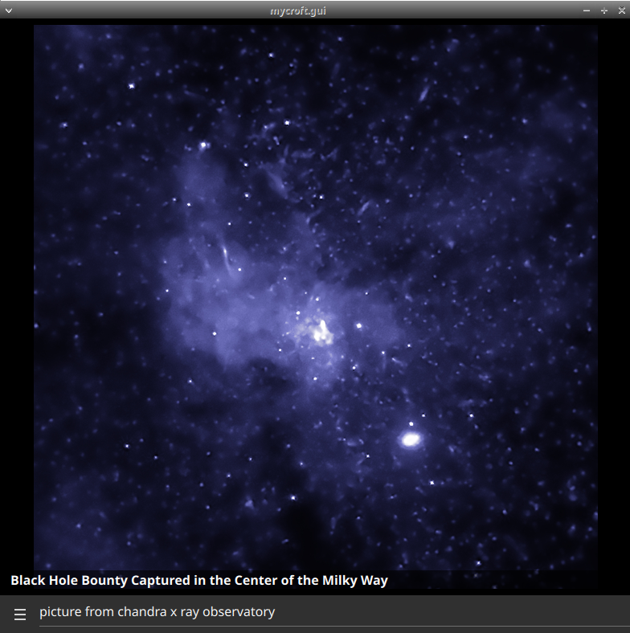
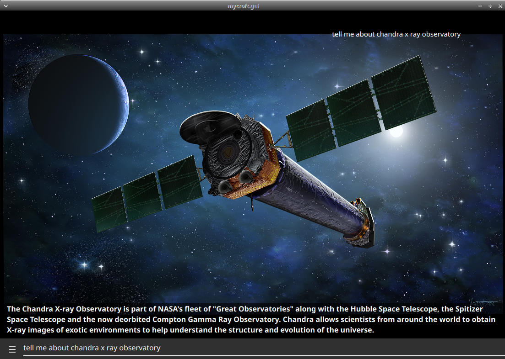
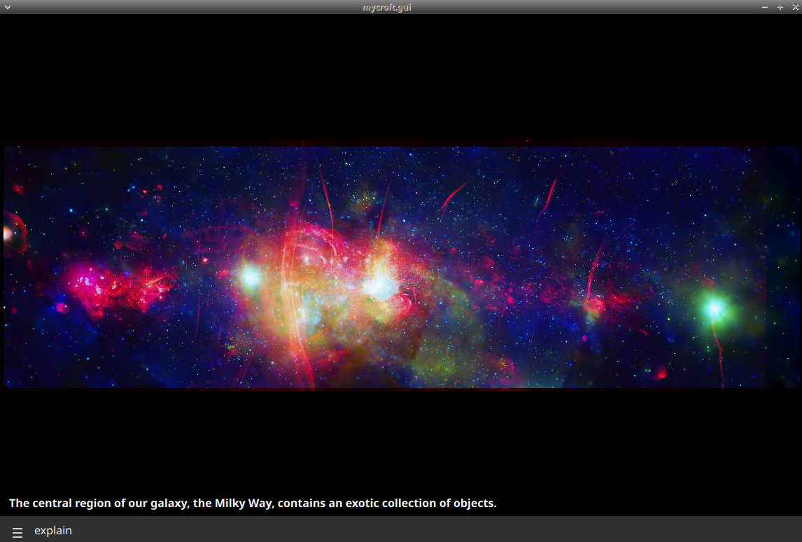
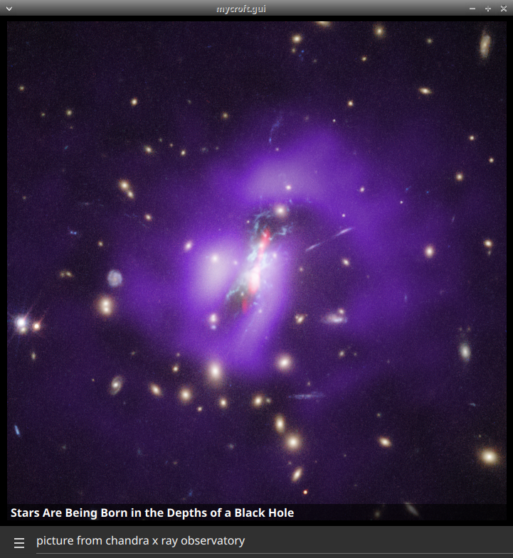

#  Chandra X-ray Observatory

## About

Pictures from NASA's [Chandra X-ray Observatory](https://www.nasa.gov/mission_pages/chandra/main/index.html)
  
Can be used as idle screen for the mark2

## Examples
* "picture from chandra x ray observatory"
* "latest nasa x ray observatory picture"
* "explain"
* "tell me about chandra x ray observatory"

## Credits
- JarbasAi
- [NASA](https://www.nasa.gov/mission_pages/chandra/main/index.html)

## Category
**Entertainment**

## Tags
#nasa
